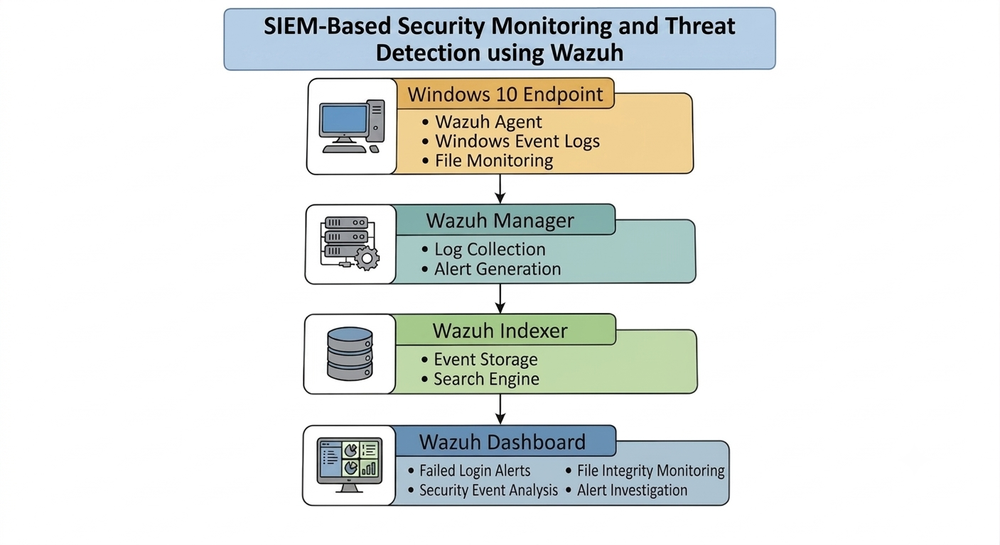
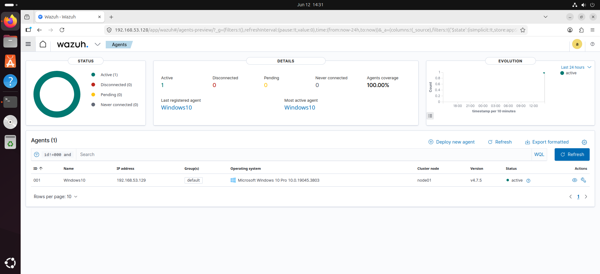
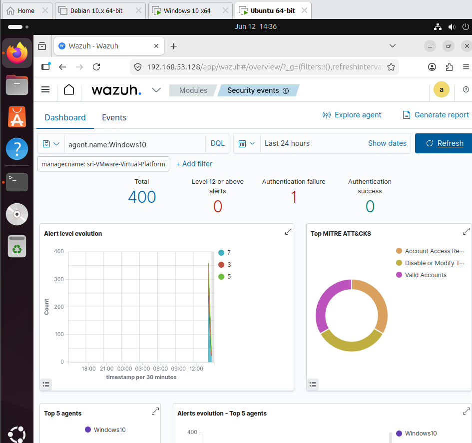
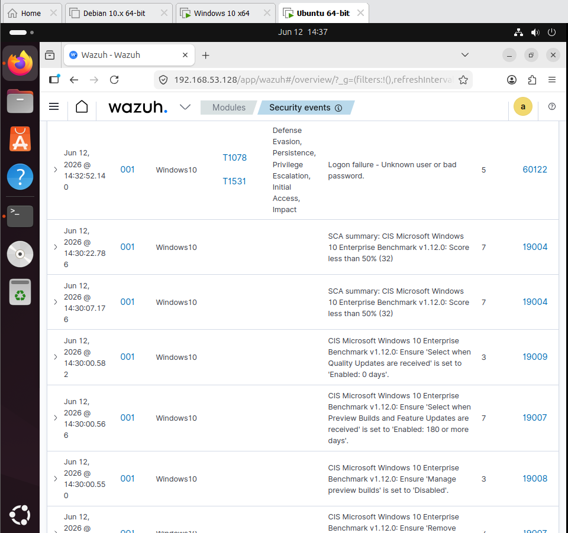
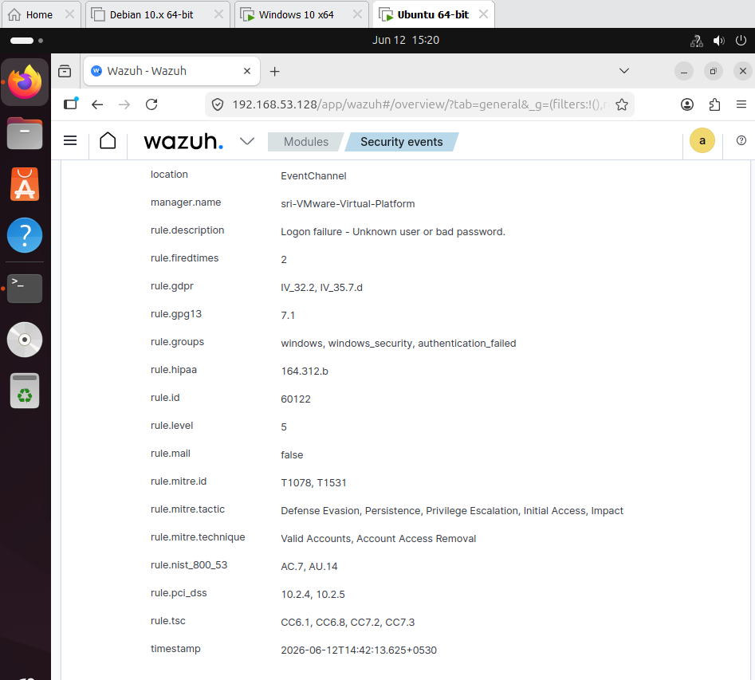
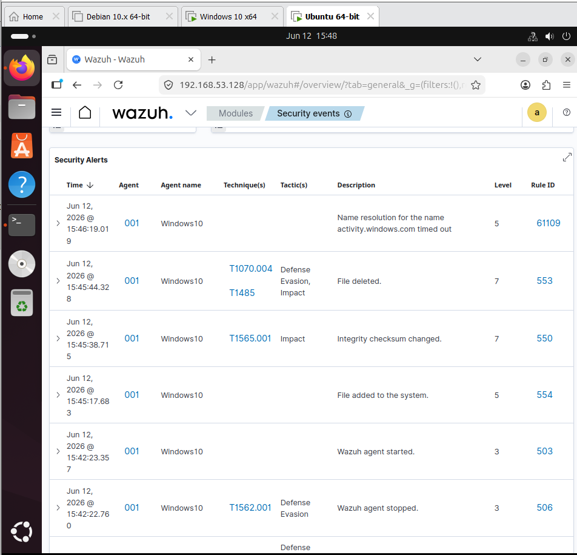
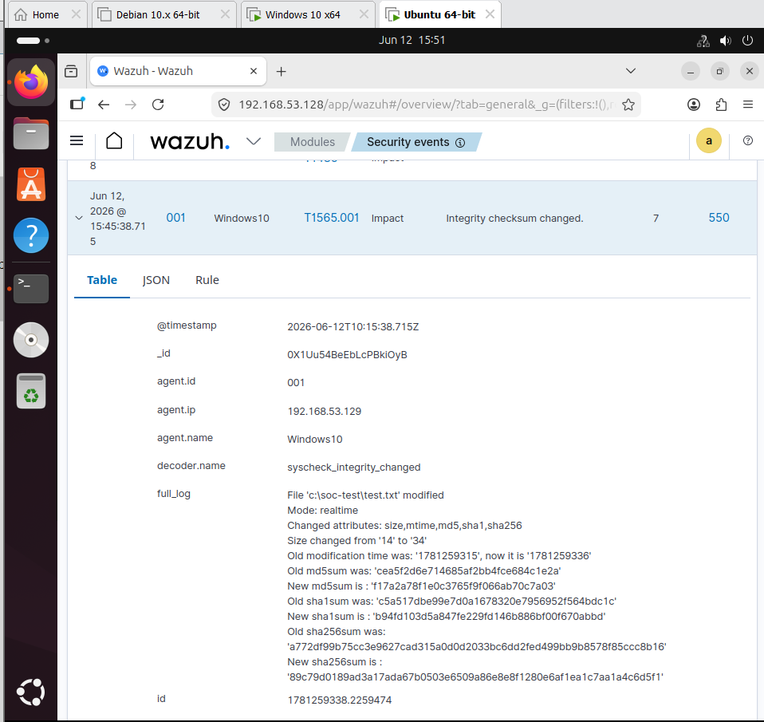

# SIEM-Based Security Monitoring and Threat Detection using Wazuh

## Overview

This project demonstrates the deployment and configuration of a Wazuh SIEM environment for security monitoring, threat detection, failed login analysis, and file integrity monitoring. The lab was built using Ubuntu and Windows virtual machines to simulate real-world endpoint monitoring, security event analysis, and alert investigation.

## Architecture



## Lab Environment

### Wazuh Server
- Ubuntu 24.04 LTS
- Wazuh Manager
- Wazuh Indexer
- Wazuh Dashboard

### Endpoint
- Windows 10
- Wazuh Agent

## Objectives

- Deploy and configure Wazuh SIEM
- Integrate Windows endpoint monitoring
- Detect authentication failures
- Implement File Integrity Monitoring (FIM)
- Investigate security alerts
- Analyze Windows security events

## Security Use Cases

### 1. Failed Login Detection

A failed login attempt was generated on the Windows endpoint and successfully detected by Wazuh.

**Rule ID:** 60122

**Alert Description:**
- Logon failure – Unknown user or bad password

**MITRE ATT&CK Mapping:**
- T1110 – Brute Force

### 2. File Integrity Monitoring (FIM)

File Integrity Monitoring was configured to monitor a test directory.

The following activities were detected:

- File Creation
- File Modification
- File Deletion

**Rule IDs:**
- 554 – File Added
- 550 – Integrity Checksum Changed
- 553 – File Deleted

## Key Screenshots

### Wazuh Login


### Agent Registration



### Security Events Dashboard



### Failed Login Detection



### Rule 60122 Alert Details



### File Integrity Monitoring Alert



### File Integrity Monitoring Event Details



## Skills Demonstrated

- Security Information and Event Management (SIEM)
- Endpoint Monitoring
- Log Analysis
- Alert Investigation
- Windows Event Monitoring
- File Integrity Monitoring (FIM)
- MITRE ATT&CK Mapping
- Incident Detection and Analysis
- Wazuh Administration

## Project Structure

```text
SIEM-Based Security Monitoring and Threat Detection using Wazuh/
│
├── README.md
├── Architecture-Diagram/
├── Screenshots/
└── Reports/
```

## Outcome

Successfully deployed a SIEM-Based Security Monitoring and Threat Detection using Wazuh capable of detecting authentication failures and file integrity events while providing centralized visibility into endpoint security activity.
